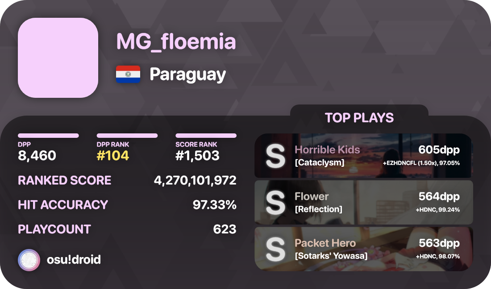
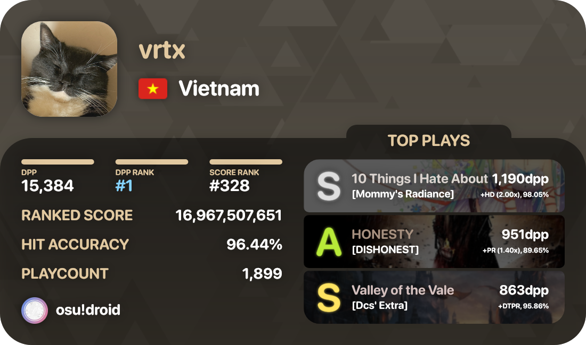
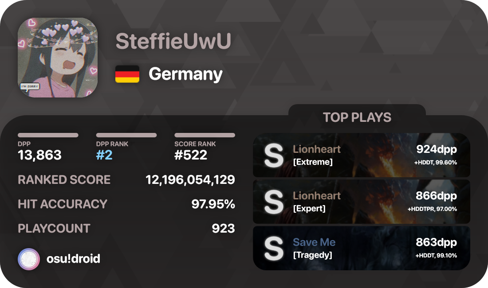
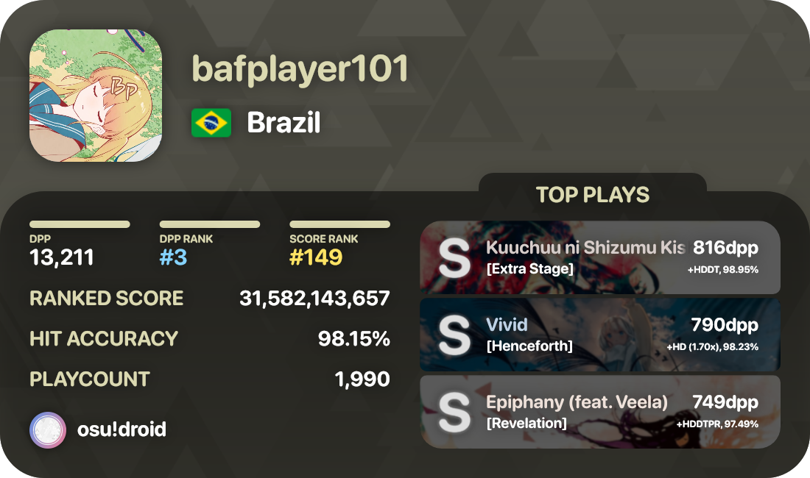
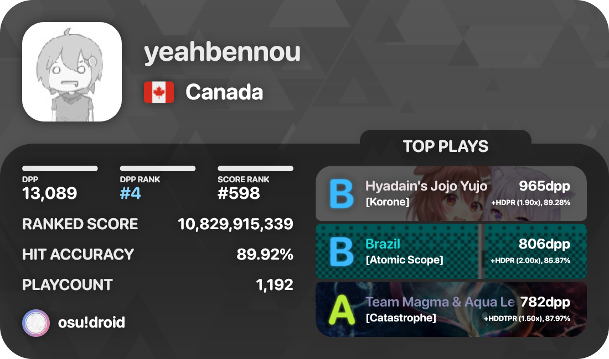
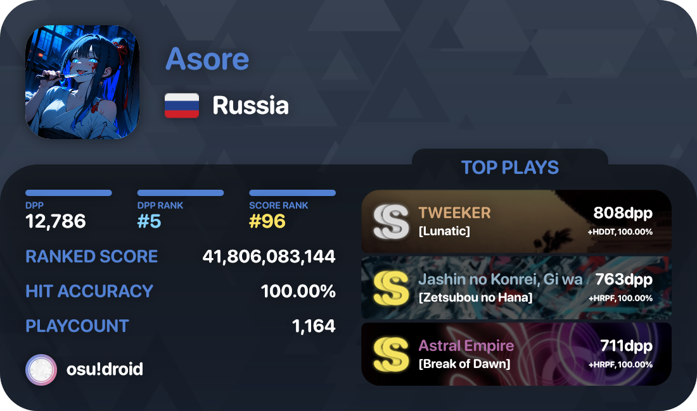

# osu!droid profile card generator

This module creates a 1100x650 `.png` osu!droid profile card containing the user's relevant data and their top plays. It uses my module [osu-droid-scraping](https://github.com/floemia/osu-droid-scraping) to get a `DroidUser` and their top plays as `DroidScore[]`, and creates the card using [@napi-rs/canvas](https://github.com/Brooooooklyn/canvas), which is returned as a `Buffer`. The accent colors are obtained by [fast-average-color-node](https://github.com/fast-average-color/fast-average-color-node).

## Requirements
- An osu! api key (stored in your `.env` file as `OSU_API_KEY`)

## Installation
`wip`
## Usage
`wip`
## Examples
 
 
 
